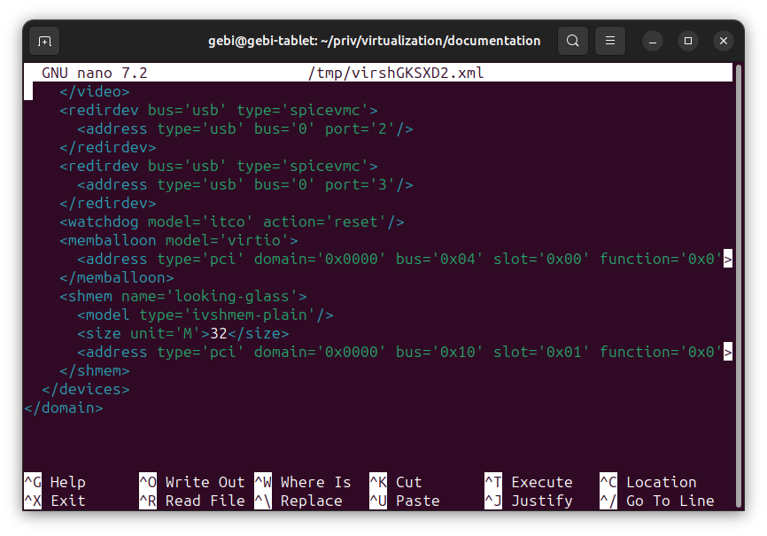

Windows 10 in virtual machine on Linux host with GPU passthrough for the integrated graphics intel Core CPUs gen. 5-9
=======================================================

This guide shows how to install Windows 10 in a virtual machine with hardware-accelerated graphics via iGPU passthrough. 

## General
The host operating system is Ubuntu 23.10. The virtual machine runs under KVM, qemu with virt-manager as the graphical frontend. The guest is windows 10.

The accelerated graphics uses _looking-glass_. This rather new technology allows to share accelerated graphics of the host and guest on the same screen! The [looking glass](https://looking-glass.io/) website brings this technology to the point: 

*Looking Glass is an open source application that allows the use of a KVM (Kernel-based Virtual Machine) configured for VGA PCI Pass-through without an attached physical monitor, keyboard or mouse. This is the final step required to move away from dual booting with other operating systems for legacy programs that require high performance graphics.*

----------------------------------------------------------- 

This guide is based on the excellent work of Pavolelsigs. He developed helper scrips: <https://github.com/pavolelsig/Ubuntu_GVT-g_helper>
and made a great video tutorial:
<https://www.youtube.com/watch?v=6-RjFl00QSk>

Note: his work is now 3J old and in the meantime some details changed. Therefore this guide, but it is recommended to watch this guide anyhow.

### Requirements
The iGPU passthrough passthrough uses software-based GVT-g. This is supported by intel cpu gen 5-9(10). See <https://wiki.archlinux.org/title/Intel_GVT-g>

### Installation

1. Check if your intel CPU if is gen 5-9: `cat /proc/cpuinfo`
1. Check if KVM is supported: `kvm-ok`
1. In the UEFI/BIOS settings there must VT-x, IOMMU, SR-IOV enabled. In many UEFI not all settings are available but if VT-x is enabled, this should be ok.
1. Download  Pavolelsigs helper scripts:
< https://github.com/pavolelsig/Ubuntu_GVT-g_helper>.
1. Download looking glass:
 <https://looking-glass.io/downloads>
1. (Optional) for sound passthrough:
 <https://github.com/duncanthrax/scream> 
1. Unpack the zip files and put them into one directory:

	user_name@pc:~/priv/virtualization$ ls
	looking-glass-B6  scream-master  Ubuntu_GVT-g_helper-master
1. Move `scream-master` into the `Ubuntu_GVT-g_helper-master` directory: `mv scream-master/ Ubuntu_GVT-g_helper-master/`

1. `cd`into `Ubuntu_GVT-g_helper-master` and make `part_1.sh` excetutable: `chmod +x part_1.sh`
1. Run `part_1.sh` as root: `sudo ./part_1.sh`
Note: `part_1.sh` is adding to `grub` the boot options `intel_iommu=on kvm.ignore_msrs=1 i915.enable_gvt=1`, it adds kernel modules, installs the dependencies to compile `looking glass`, sets permissions, and installs the virtualization SW `qemu` with the frontend `virt-manager`.		
At the end, it prompts a safety question if the boot options are OK.
1. Reboot the Linux host.
1. Enter `Ubuntu_GVT-g_helper-master` and run `part_2.sh` as root: `sudo ./part_2.sh`
Note: `part_2.sh` does the 'heavy loading' of the installation. It finds the right Intel VGPU, sets user permissions, and creates a `systemd` service to initialize the VGPU during startup. Cool!
`part_2.sh` also creates `check_gpu.sh`. Run it `./check_gpu.sh` and you should see a long number like: `69763959-1724-46a3-8878-860096be8669`. This is the uuid of the VGPU. If you see such a long number, everything should be fine.
Note: the properties of the VGPUs (yes, there are more than one) can be seen in the `/sys/devices/pci*` directories. On my machine, the used VGPU is in `/sys/devices/pci0000:00/0000:00:02.0/mdev_supported_types/i915-GVTg_V5_4/description`. The contents of this file is:
  
	low_gm_size: 128MB
	high_gm_size: 512MB
	fence: 4
	resolution: 1920x1200
	weight: 4
1. Optional: run `sudo ./part_3_optional.sh`. This compiles scream for the sound and adds an auto-start service for gnome.
1. Compile looking-glass from source.
Change the directory into `looking-glass-B6/` and create a build directory: `mkdir client/build`. Enter this directory: `cd client/build/` and do a `cmake ../` and `make`

A successful compilation looks like this: 

	[100%] Linking CXX executable looking-glass-client
	[100%] Built target looking-glass-client
and the executable is: `looking-glass-client`

Note: I had some missing dependencies. Just install the missing libs with the corresponding development files `.dev`
1. Now the Linux host is ready and we can do the installation of Windows in the virtual machine.

Open `virt-manger` and select the left top button 'create a new virtual machine'.

and browse for the image of win10.iso

step 4 creates in `/var/lib/libvirt/images/win10-2.qcow2` a file of 40GB. This represents the virtual disc space of win10 guest. It is arguably a good idea to define a 'custom storage' place that is not in the root partition.
1. Ready to begin with the win10 installation:
   

Don´t forget to tick on 'customize configuration before install'. This brings us to all settings:

In the overview, we need to select UEFI as boot firmware. Under CPU we select 'copy host CPU selection'

here with 1 socket, 4 cores (4 remain for the host), and 2 threads. For the memory let's take half of the available.

Under 'Boot Options' select an additional 'cdrom 1' to mount the win10.iso.

Now we are ready to fire up the VM. 
Press quickly F2 to enter the UEFI and under 'Device manager  / secure boot configuration' disable 'Attempt Secure Boot'

Save and exit the UEFI. -> The installation of win10 starts. After the win10 installation perform an update and reboot the win10 guest.

Note: Every Win10 should work but must be 64-bit. Some people recommend Win10 LTSC, due to the more predictable updates and longer support.
  
1. Under win10, download looking-glass from <https://looking-glass.io/downloads>. Use the same version as for the Linux host (at the time of writing: B6). Shutdown win10.

Note: there is a difference to the video of Pavolelsigs video (at 13:40). We don't need to download/install 'iommu' as this is now a part of looking-glass.

Next, we have to configure virt-manger.

Close virt-manger and edit the config file of the win10 VM configuration via: `sudo virsh edit win10-2`, where win10-2 is the name of your VM.
 
In the `<\devices>` section we have to add:

	<shmem name='looking-glass'>
     <model type='ivshmem-plain'/>
     <size unit='M'>32</size>
    </shmem>
32M memory should be enough for 1080p. See looking-glass documentation for the details.

Start virt-manager and in the VM details, press the button 'add hardware' and select in the new window 'MDEV Host Device'. This is the passthrough GPU. Alternatively (as in the video) you can manually add the XML. In the 'Ubuntu_GVT-g_helper-master' directory is a generated file called `virsh.txt` with the content.

Start the win10 VM. Install looking glass as admin.

Open the device manager. Under 'Display adapter' we finally see the host Intel-GPU:

Big smile now - Win10 sees the host GPU!

Note: you may have to manually trigger an update of the display adapter and/or do a restart of the VM.

Shutdown the VM. Go into virtmanger and set 'Video' to none:

Start the win10 VM. Enter the directory of the looking-glass client and start it: `./looking-glass-client -F -m KEY_F9 -c`.
Looking glass has many options. Here we use `-F` for fullscreen, `F9` to capture the mouse in the VM and `-c` for a shared clipboard. As second time `F9` brings the mouse to the host back.

IMHO: the graphics performance is very good. Close to bare-metal. At the moment we just have a basic VM configuration. For better network performance we can install the virtio drivers and for the sound: spice pass-through.  
